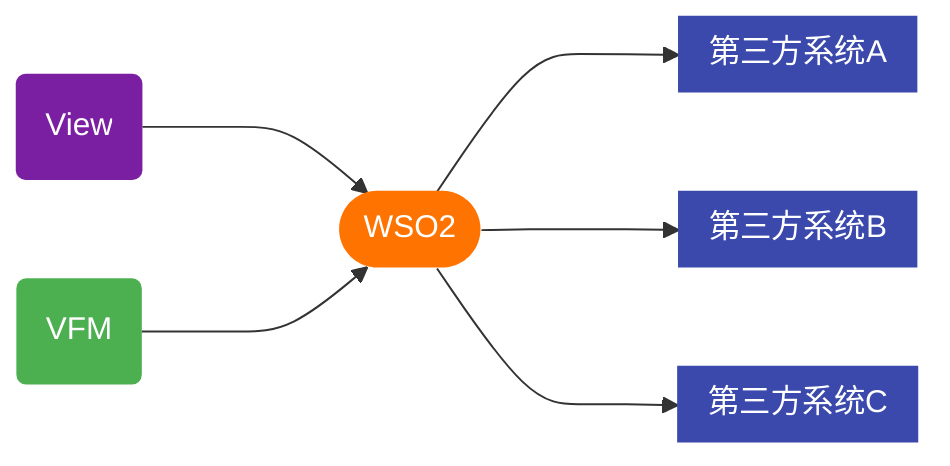

# 使用外部接口

> View 通过 WSO2 请求第三方系统 API



## 1.创建Api

打开 API 管理页面并登录: [https://localhost:9443/publisher](https://localhost:9443/publisher)
<br>
账号: `admin`     
密码: `admin`

选择 `REST API` 类型的接口


点击 `Start From Scratch` 创建新的 API

填入接口信息


配置第三方接口的认证信息


## 2.创建App

App管理页面:[https://localhost:9443/devportal/applications](https://localhost:9443/devportal/applications)


## 3.生成OAuth认证密钥


## 4.绑定Api和App


## 5.在代码中配置认证信息

手动创建: `core/.restfulapi.authentication.ini` 文件(注意文件名包含.号)，填入如下内容

```ini
[VIEW_DEMO_APPLICATION]
;WSO2的OAuth认证接口
gatewayAuthUrl="https://172.16.1.94:9443/oauth2"
;WSO2的Oauth帐号信息
consumerKey="xdv5SZLHEIR4Ux8jc14ugJLWDD4a"
consumerSecret="kvsoaXylTKa2X9HvCepn9bfrYyoa"
;WSO2中的API接口地址
gatewayRecourceUrl="https://172.16.1.94:8243"
```

## 6.使用WSO2发送请求

`core/web/wso2.php`

```php
<?php

define('NO_USER_REQUIRED', true);
define('NO_PERMISSION_REQUIRED', true);
ini_set("display_errors", true);
error_reporting(E_ALL);
ini_set('default_socket_timeout', 300);
ini_set('soap.wsdl_cache_enabled', '0');
ini_set('soap.wsdl_cache_ttl', '0');

require_once("{$_SERVER['DOCUMENT_ROOT']}/../sys/libs/init.lib");
require_once("{$_SERVER['DOCUMENT_ROOT']}/../sys/libs/logic/Util/Gateway/ViewGateway.lib");

use VIEW\Util\Gateway\ViewGateway;

// .ini配置文件中配置名称
CONST CONFIG_NAME = 'VIEW_DEMO_APPLICATION';
// WSO2中创建的API名称
CONST API_NAME = 'Demo';
// API路径
CONST API_URI = '/demo';
// API版本
CONST API_VERSION = '1.0';

try {

    $viewGateway = new ViewGateway(CONFIG_NAME, "");

    // 发送请求
    $result = $viewGateway->post(API_NAME, [], 0, null, null, API_VERSION, true, 2, API_URI);
    if (!$result) {
        echo 'request fail';
    }
} catch (Exception $e) {
    var_dump($e);
}
```

## 7.处理WSO2响应数据
创建处理文件: `core/sys/libs/logic/Util/Gateway/Handler/DemoGatewayBizHandler.php`

*文件命名规范：<App名称>GatewayBizHandler.php*

```php
<?php

namespace VIEW\Util\Gateway\Handler;

require_once("{$_SERVER['DOCUMENT_ROOT']}/../sys/libs/curl_api_adapter/curl.lib");
require_once("{$_SERVER['DOCUMENT_ROOT']}/../sys/libs/view_exceptions/autoloader.php");
require_once(SYSTEM_DIR . '/libs/logic/external_access_logger/bo/ExternalAccessLogger.lib');
require_once SYSTEM_DIR . '/libs/jwt_wrapper/autoloader.php';

use VIEW\Util\Gateway\ViewGatewayBizHandlerBaseService;

class DemoGatewayBizHandler extends ViewGatewayBizHandlerBaseService
{
    /**
     * Demo
     *
     * @param $applicationName
     * @param $apiName
     * @param $requestMethod
     * @param $requestData
     * @param $version
     * @param $retutrnValue
     * @param $identifier
     *
     * @author wadewang
     * @date 2022-02-25
     */
    public function onFinish($applicationName, $apiName, $requestMethod, $requestData, $version, $retutrnValue, $identifier)
    {
        var_dump($retutrnValue);
        parent::onFinish($applicationName, $apiName, $requestMethod, $requestData, $version, $retutrnValue, $identifier);
    }
}
```

## 8.接口调试

获取AccessToken的接口


在View中测试
