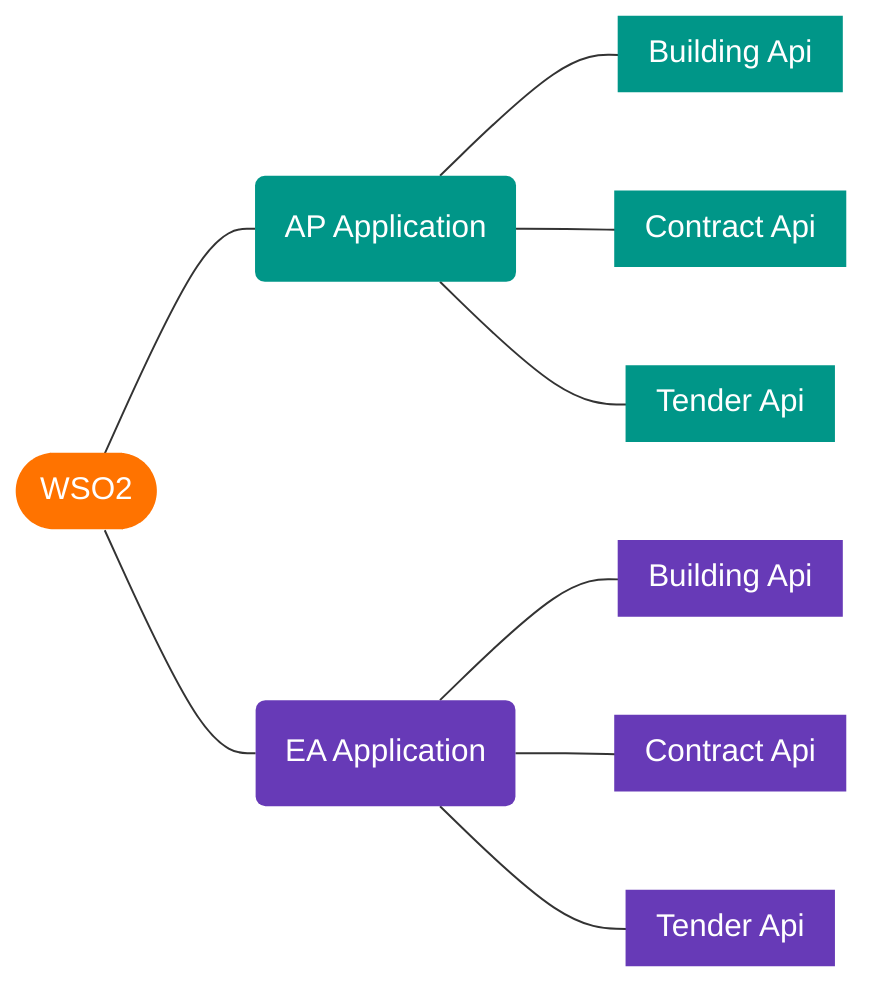

# WSO2

> [WSO2](https://wso2.com/) 是一个轻量级，高性能和高集成的Web服务中间件平台。

## 核心概念

- Api: WSO2和外部系统的接口通信服务
- Application: 用来为Api分组以及授权、限流等

两者关系示例:

## API Manager(AM)

[API Manager](https://hub.docker.com/r/wso2/wso2am) 是一个用于部署和管理API的工具，提供了API整个生命周期所需要的各种控制，包含访问权限，访问流量，监控API的调用，版本控制等。

Api管理: [https://localhost:9443/publisher/apis](https://localhost:9443/publisher/apis)	  
App管理: [https://localhost:9443/devportal/applications](https://localhost:9443/devportal/applications)

账号: `admin`     
密码: `admin`

## Micro Integrator(MI)

[Micro Integrator](https://hub.docker.com/r/wso2/wso2mi) 是一个开源、轻量级、快速、可扩展的分布式微服务集成层，是 Enterprise Integration(EI) 的云原生发行版。

## Swagger Editor

[Swagger Editor](https://swagger.io/) 是一个API文档编辑器

- 本地编辑器: [http://localhost:8080/](http://localhost:8080/)
- 在线编辑器: [https://editor.swagger.io/](https://editor.swagger.io/)
