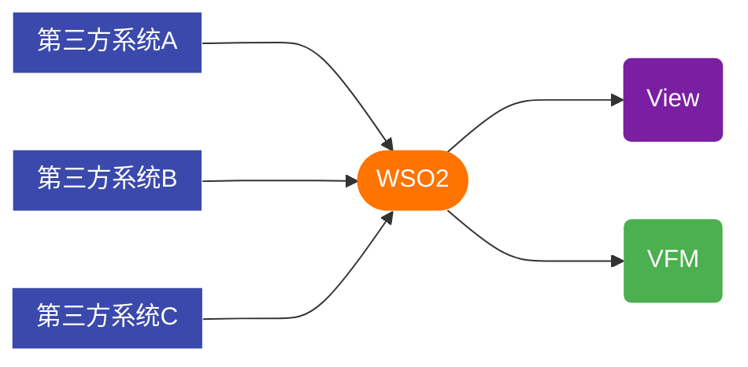

# 对外提供接口

> 第三方系统 通过 WSO2 请求 View API



## 1.创建接口

在 `web/sharp/modules/api/controllers` 目录下创建一个名为 `DemoController.php` 的文件，复制并粘贴以下内容。
```php
<?php

include_once(dirname(__FILE__) . '/RestfulController.php');

class Api_DemoController extends Api_RestfulController
{
    protected $scope = 'Demo';

    /**
     * Demo
     */
    public function indexAction()
    {
        if ($_GET['status'] === 'error') {
            return $this->error('invalid phone number.', 422);
        }

        return $this->success(
            [
                'userId'      => 888,
                'nickName'    => 'Demo',
                'phoneNumber' => '12345678910'
            ],
            'success'
        );
    }
}
```

## 2.配置账号

在 `core` 目录下创建一个名为: `.restfulapi.authentication.ini` 的文件（文件名以'.'号开始），并复制粘贴以下内容。
```ini
;API账号信息
[API_DEMO]
password="123456"
scopes="Demo,Test"
```
- API_DEMO 将作为 `Basic Auth` 认证的账号
- scopes 填写接口文件中的 `$scope` 变量，多个scope可以使用","号隔开

## 3.接口调试

> 本地开发不需要经过WSO2，可以直接进行测试

接口地址: `http://hk.preview.test/sharp/api/demo`

认证方式选择 `Basic Auth`，账号密码使用上面配置的信息